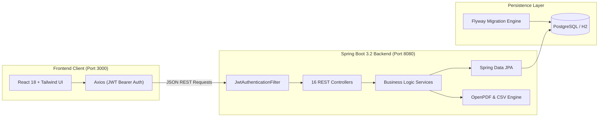

# Apartment Society Manager

[](.github/workflows/ci.yml)
[](LICENSE)
[](https://openjdk.org/projects/jdk/21/)
[](https://spring.io/projects/spring-boot)
[](https://react.dev/)
[](https://www.typescriptlang.org/)
[](https://www.postgresql.org/)

A full-stack web application designed for residential societies and apartment complexes. It automates administrative tasks, billing workflows, gate security tracking, resident services, and financial reporting.

---

## Table of Contents

- [Overview](#overview)
- [Features](#features)
- [User Roles](#user-roles)
- [Technology Stack](#technology-stack)
- [Architecture](#architecture)
- [Modules](#modules)
- [Project Structure](#project-structure)
- [Prerequisites](#prerequisites)
- [Installation](#installation)
- [Environment Variables](#environment-variables)
- [Database Setup](#database-setup)
- [Running the Application](#running-the-application)
- [Screenshots](#screenshots)
- [API](#api)
- [Security](#security)
- [Deployment](#deployment)
- [License](#license)
- [Author](#author)

---

## Overview

**Apartment Society Manager** is a management platform built to address operational challenges faced by residential housing societies, resident welfare associations (RWAs), and apartment complexes. 

### Problem It Solves
Traditional society operations rely heavily on manual paper logs, informal chat groups, disjointed spreadsheets, and physical receipt books. This leads to untracked maintenance dues, delayed complaint resolution, gate security lapses, and lack of financial transparency.

### Who Uses It
1. **Society Management & Administrators**: To oversee property blocks, configure billing structures, manage staff, broadcast circulars, and monitor operations.
2. **Accountants**: To generate monthly maintenance batches, record dues collections, log operational expenditures, and export financial audit trails.
3. **Residents (Owners & Tenants)**: To track maintenance invoices, make payments online, download official PDF receipts, register visitors, and track helpdesk tickets.
4. **Security Personnel**: To log visitor entries and departures at entry gates, issue visitor badges, and verify resident pre-approvals.

---

## Features

All features listed below are fully implemented in the codebase:

- **Authentication & RBAC**: Stateless JWT Bearer authentication with Role-Based Access Control across 5 distinct system roles.
- **Society & Building Management**: Hierarchical structure from residential blocks/towers to individual flats with floor numbers and square footage.
- **Flat & Occupancy Management**: Unit-level tracking for occupancy status (`OWNER_OCCUPIED`, `TENANT_OCCUPIED`, `VACANT`, `UNDER_MAINTENANCE`), parking assignments, and owner details.
- **Resident Directory**: Management of primary residents, family members, lease terms, emergency contacts, and registered vehicles.
- **Batch Maintenance Billing**: Configurable recurring dues calculation based on flat square footage plus fixed parking and water fees, with automated status updates (`GENERATED`, `PENDING`, `PARTIALLY_PAID`, `PAID`, `OVERDUE`).
- **Payment Processing & Receipts**: Recording payments with multiple payment methods (UPI, Bank Transfer, Card, Cash), with downloadable PDF official payment receipts.
- **Complaint Helpdesk**: Ticketing workflow with categorized issues (Plumbing, Electrical, Lift, Security, etc.), priority levels (`LOW`, `MEDIUM`, `HIGH`, `CRITICAL`), staff assignment, and timestamped comment threads.
- **Visitor Gate Management**: Real-time gate logging of visitors, resident pre-registration passes, vehicle numbers, badge assignments, and check-in/check-out timestamps.
- **Society Expense Tracking**: Expense voucher recording categorized into utilities, AMC contracts, security wages, and repair costs.
- **Notice Board**: Digital notice broadcasts with audience filtering (`ALL`, `RESIDENTS`, `OWNERS`) and urgency priorities (`HIGH`, `EMERGENCY`).
- **Role-Tailored Dashboards**: Specialized KPI metrics and visual charts (Recharts) for Admins, Residents, and Security teams.
- **Financial & Operational Reports**: Generation and export of Defaulters Lists, Financial Statements, Expense Audits, and Resident Rosters in both PDF and CSV formats.
- **In-App Notifications**: Real-time notification feed for newly generated bills, status updates on complaints, and gate visitor alerts.
- **Audit Logging**: Immutable system event logging capturing user IDs, timestamps, affected entities, and client IP addresses.

---

## User Roles

The platform implements five distinct roles with explicit authorization boundaries:

| Role | Access Scope & Responsibilities |
| :--- | :--- |
| **`ROLE_SUPER_ADMIN`** | Full administrative rights: user management, role assignments, audit logs, system configurations, and all operational modules. |
| **`ROLE_SOCIETY_ADMIN`** | Daily operational control: manage buildings, flats, residents, staff directory, notices, complaints, and view society metrics. |
| **`ROLE_ACCOUNTANT`** | Financial management: batch maintenance bill generation, payment verification, expense voucher entry, and financial CSV/PDF report exports. |
| **`ROLE_RESIDENT`** | Resident portal: view and pay outstanding flat dues, download receipts, submit and comment on helpdesk tickets, pre-register visitors, and view society circulars. |
| **`ROLE_SECURITY`** | Gate portal: log guest arrivals, check badge numbers, record vehicle registration numbers, and manage visitor check-outs. |

---

## Technology Stack

The stack is composed strictly of the following technologies discovered in the project:

### Backend
- **Language**: Java 21 (LTS)
- **Framework**: Spring Boot 3.2.5
- **Security**: Spring Security 6 with JJWT (`io.jsonwebtoken` 0.12.5)
- **ORM / Persistence**: Spring Data JPA / Hibernate
- **Database Migrations**: Flyway Database Migration (`flyway-core`, `flyway-database-postgresql`)
- **PDF Generation**: OpenPDF 2.0.3 (`com.github.librepdf:openpdf`)
- **API Documentation**: SpringDoc OpenAPI 2.5.0 (Swagger UI)
- **Build Tool**: Apache Maven (via Maven Wrapper `mvnw`)

### Frontend
- **Framework / Runtime**: React 18.2.0 with TypeScript 5.2.2
- **Build Tool / Bundler**: Vite 5.2.0
- **Routing**: React Router DOM 6.22.3
- **Styling**: Tailwind CSS 3.4.3, PostCSS, Autoprefixer
- **Visualizations**: Recharts 2.12.5
- **Icons**: Lucide React 0.368.0
- **Forms & Validation**: React Hook Form 7.51.3, Zod 3.22.4, `@hookform/resolvers`
- **HTTP Client**: Axios 1.6.8 (with JWT bearer interceptor)

### Databases
- **Production / Dev**: PostgreSQL 16
- **Local Embedded**: H2 Database (In-Memory mode)

### DevOps & Infrastructure
- **Containers**: Docker Engine, Docker Compose
- **Web Server / Reverse Proxy**: Nginx Alpine
- **CI / CD**: GitHub Actions (`.github/workflows/ci.yml`)

---

## Architecture

The system follows a modern decoupled client-server architecture:



For full architectural details, see [System Architecture](docs/architecture.md).

---

## Modules

The application is structured into the following operational modules:

1. **Authentication & Authorization (`com.society.manager.security`)**: Handles token issuance, validation, user details, and method security (`@PreAuthorize`).
2. **Properties & Units (`Building`, `Flat`)**: Manages physical structure, unit floor distribution, square footage, and occupancy flags.
3. **Residents & Occupants (`Resident`, `FamilyMember`, `Vehicle`)**: Tracks tenancy records, vehicle parking permits, and emergency contacts.
4. **Billing & Accounting (`MaintenanceBill`, `Payment`, `SocietyExpense`)**: Computes square-footage-based dues, processes payments, and accounts for society outlays.
5. **Helpdesk & Ticketing (`Complaint`, `ComplaintComment`, `Staff`)**: Coordinates maintenance requests between residents and staff personnel.
6. **Gate Security (`Visitor`)**: Manages visitor check-ins, vehicle tracking, and resident pre-approvals.
7. **Communication (`Notice`, `Notification`)**: Disseminates announcements and individual alerts.
8. **Reporting & Compliance (`ReportService`, `AuditLog`)**: Generates CSV/PDF summaries and maintains non-repudiation audit trails.

---

## Project Structure

```text
apartment-society-manager/
├── .github/
│   └── workflows/
│       └── ci.yml               # GitHub Actions CI pipeline
├── .vscode/
│   └── settings.json            # VS Code Java LS environment settings
├── backend/
│   ├── .mvn/                    # Maven wrapper binaries
│   ├── src/
│   │   ├── main/
│   │   │   ├── java/com/society/manager/
│   │   │   │   ├── config/      # Security, CORS, OpenAPI configuration
│   │   │   │   ├── controller/  # 16 REST API controllers
│   │   │   │   ├── dto/         # Request & Response DTOs
│   │   │   │   ├── entity/      # JPA Data Entities
│   │   │   │   ├── enums/       # Domain enumerations
│   │   │   │   ├── exception/   # Global exception handling
│   │   │   │   ├── mapper/      # Entity-DTO mapping
│   │   │   │   ├── repository/  # Spring Data JPA repositories
│   │   │   │   ├── security/    # JWT Provider, Filter, UserDetailsService
│   │   │   │   ├── service/     # Business logic implementations
│   │   │   │   └── specification/# Dynamic query specifications
│   │   │   └── resources/
│   │   │       ├── db/migration/# Flyway V1 (Schema) and V2 (Seed Data)
│   │   │       ├── application.yml
│   │   │       ├── application-dev.yml
│   │   │       ├── application-h2.yml
│   │   │       ├── application-prod.yml
│   │   │       └── application-test.yml
│   │   └── test/                # JUnit & Mockito unit tests
│   ├── Dockerfile               # Multi-stage Maven + Temurin JRE build
│   ├── mvnw.cmd                 # Maven wrapper script (Windows)
│   └── pom.xml                  # Maven dependencies & build configuration
├── frontend/
│   ├── public/                  # Static assets & favicon
│   ├── src/
│   │   ├── api/                 # Axios HTTP client & API service modules
│   │   ├── components/          # Reusable UI components & ProtectedRoute
│   │   ├── context/             # Authentication & notification React contexts
│   │   ├── layouts/             # Dashboard shell & navigation sidebar
│   │   ├── pages/               # 17 application views (Dashboards, Tables, Forms)
│   │   ├── types/               # TypeScript data interfaces & types
│   │   ├── App.tsx              # Root application router
│   │   ├── index.css            # Tailwind CSS directives
│   │   └── main.tsx             # Application entrypoint
│   ├── Dockerfile               # Multi-stage Node build + Nginx Alpine
│   ├── nginx.conf               # Nginx reverse proxy configuration
│   ├── package.json             # NPM dependencies and scripts
│   ├── tailwind.config.js       # Tailwind configuration
│   ├── tsconfig.json            # TypeScript compiler configuration
│   └── vite.config.ts           # Vite bundler & API proxy configuration
├── docs/
│   ├── api.md                   # Complete REST API reference
│   ├── architecture.md          # In-depth architectural design
│   ├── database.md              # Database schema & ER diagram
│   ├── deployment.md            # Production deployment instructions
│   └── samples/                 # Sample generated PDFs and CSV exports
├── .env.example                 # Environment variables template
├── .gitignore                   # Multi-technology Git exclusion rules
├── CHANGELOG.md                 # Semantic version changelog
├── CODE_OF_CONDUCT.md           # Contributor Covenant Code of Conduct
├── CONTRIBUTING.md              # Contribution and PR guidelines
├── docker-compose.yml           # Complete containerized multi-service stack
├── LICENSE                      # Official MIT License
├── README.md                    # Primary repository documentation
├── SECURITY.md                  # Vulnerability disclosure policy
└── THIRD-PARTY-NOTICES.md       # Open-source license attribution catalog
```

---

## Prerequisites

Before running the application locally, ensure you have the following installed:

- **Java Development Kit (JDK)**: Version 21 LTS
- **Node.js**: Version 20 LTS or higher, with `npm`
- **PostgreSQL**: Version 16+ (Optional if using embedded H2 mode)
- **Git**: Version 2.20+
- **Docker & Docker Compose**: (Optional, for containerized execution)

---

## Installation

### 1. Clone the Repository
```bash
git clone https://github.com/Aditya7732/apartment-society-manager.git
cd apartment-society-manager
```

### 2. Configure Environment Variables
Copy the template to create your `.env` file:
```bash
cp .env.example .env
```
Update `.env` with your local database credentials and a 256-bit JWT secret.

---

## Environment Variables

The project utilizes the following variables (referenced in `.env.example`):

| Variable | Description | Default (Local Dev) |
| :--- | :--- | :--- |
| `SPRING_PROFILES_ACTIVE` | Active Spring profile (`dev`, `h2`, `prod`) | `dev` |
| `PORT` | Backend server port | `8080` |
| `DATABASE_URL` | JDBC connection string | `jdbc:postgresql://localhost:5432/society_db` |
| `DATABASE_USERNAME` | PostgreSQL username | `postgres` |
| `DATABASE_PASSWORD` | PostgreSQL password | None (set in `.env`) |
| `JWT_SECRET` | HMAC-SHA 256-bit base64 secret key | None (set in `.env`) |
| `JWT_EXPIRATION_MS` | Access token lifespan in milliseconds | `86400000` (24 hours) |
| `JWT_REFRESH_EXPIRATION_MS` | Refresh token lifespan in milliseconds | `604800000` (7 days) |
| `ALLOWED_ORIGINS` | Comma-separated CORS allowed origins | `http://localhost:3000,http://localhost:5173` |
| `UPLOAD_DIR` | File attachment directory path | `./uploads` |
| `VITE_API_BASE_URL` | Frontend API endpoint path | `http://localhost:8080/api` |

---

## Database Setup

### Option A: Using PostgreSQL (Recommended)
1. Create a local PostgreSQL database:
   ```sql
   CREATE DATABASE society_db;
   ```
2. Start the backend with the `dev` profile. Flyway automatically creates all 18 tables (`V1__initial_schema.sql`) and loads initial demo records (`V2__seed_data.sql`).

### Option B: Quick Start with In-Memory H2
To run without installing PostgreSQL, activate the `h2` profile:
```bash
# In backend directory
./mvnw spring-boot:run -Dspring-boot.run.profiles=h2
```
The H2 web console will be available at `http://localhost:8080/h2-console` (JDBC URL: `jdbc:h2:mem:society_db`, Username: `sa`, Password: empty).

### Demo Seed Accounts
The demo database includes the following pre-configured demonstration accounts (all pre-seeded with initial password `Password@123`):

| Role | Username | Password |
| :--- | :--- | :--- |
| Super Admin | `admin` | `Password@123` |
| Society Admin | `manager` | `Password@123` |
| Accountant | `accountant` | `Password@123` |
| Resident (Owner) | `resident1` | `Password@123` |
| Resident (Tenant) | `resident2` | `Password@123` |
| Security Guard | `security` | `Password@123` |

---

## Running the Application

### Running Backend
```bash
cd backend
./mvnw clean package -DskipTests
./mvnw spring-boot:run
```
- API Base: `http://localhost:8080/api`
- Swagger UI: `http://localhost:8080/swagger-ui.html`

### Running Frontend
```bash
cd frontend
npm install
npm run dev
```
- Web Application: `http://localhost:3000`

### Running with Docker Compose
To launch PostgreSQL, Spring Boot, and Nginx frontend in a single command:
```bash
docker-compose up --build -d
```
Access the application at `http://localhost`.

---

## Screenshots

Sample outputs and export documents produced by the system are preserved in [`docs/samples/`](docs/samples/):

* [`bill_sample.pdf`](docs/samples/bill_sample.pdf): Dynamically generated maintenance bill with unit area breakdown.
* [`receipt_sample.pdf`](docs/samples/receipt_sample.pdf): Official society payment receipt.
* [`report_defaulters.pdf`](docs/samples/report_defaulters.pdf): Tabular report of overdue resident balances.
* [`report_financial.pdf`](docs/samples/report_financial.pdf): Monthly financial collection statement.
* [`report_expenses.csv`](docs/samples/report_expenses.csv): Spreadsheet export of categorized expenses.
* [`report_residents.pdf`](docs/samples/report_residents.pdf): Verified society resident directory.

---

## API

The backend provides 16 REST resource areas. For detailed request/response schemas, parameters, and payloads, consult [REST API Reference](docs/api.md).

Interactive documentation is available via SpringDoc OpenAPI:
* **Interactive UI**: `http://localhost:8080/swagger-ui.html`
* **OpenAPI Specification**: `http://localhost:8080/v3/api-docs`

---

## Security

Security protections implemented in the project include:

- **JWT Authentication**: Stateless token generation using HMAC-SHA algorithms with configurable expiration.
- **Password Hashing**: Passwords stored as salted BCrypt hashes (`BCryptPasswordEncoder`).
- **Role-Based Authorization**: Methods protected via `@PreAuthorize("hasRole('...')")` and route guarding on the frontend (`ProtectedRoute.tsx`).
- **Input Validation**: Bean Validation (`@Valid`, `@NotNull`, `@Size`, `@Email`) on all incoming request DTOs.
- **CORS Protection**: Explicit allowed origins configured in Spring Security filter chain.
- **XSS & Injection Protection**: Parameterized queries via Spring Data JPA / Hibernate preventing SQL injection.
- **Immutable Audit Logging**: Operational actions, user IDs, and client IP addresses logged to `audit_logs`.

---

## Deployment

Refer to [Deployment Guide](docs/deployment.md) for full instructions on deploying via Docker Compose, configuring Nginx reverse proxying, managing persistent volumes, and running database backups.

---

## License

This project is open-source and licensed under the [MIT License](LICENSE).

---

## Author

**Aditya**
- Project Repository: [Apartment Society Manager](https://github.com/Aditya7732/apartment-society-manager)
