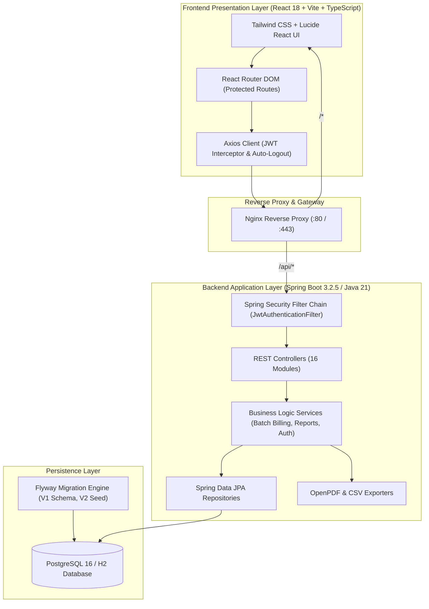

# System Architecture

This document details the architectural design, technical components, and data flow of the **Apartment Society Manager** application.

---

## 1. High-Level Architectural Diagram

The system employs a decoupled, client-server architecture with a React single-page application (SPA) communicating over HTTPS/JSON REST APIs with a Spring Boot backend, backed by PostgreSQL.



---

## 2. Frontend Architecture

The frontend is built using **React 18** and **TypeScript**, bundled with **Vite**:

* **Layouts**: Responsive layout with collapsible sidebar navigation, dynamic breadcrumbs, role-tailored navigation items, and real-time notification alerts.
* **State & Authentication**: Stateless JWT stored in browser local storage. `axiosClient.ts` automatically attaches the Bearer token to all outgoing requests and intercepts `401 Unauthorized` responses to purge expired tokens and redirect to `/login`.
* **Route Protection (`ProtectedRoute.tsx`)**: Evaluates authentication state and checks the user's role against allowed roles (`SUPER_ADMIN`, `SOCIETY_ADMIN`, `ACCOUNTANT`, `RESIDENT`, `SECURITY`).
* **Visualizations**: Interactive charts implemented with **Recharts** for monthly maintenance collections, occupancy breakdown, and expense distributions.

---

## 3. Backend Architecture

The backend is organized according to clean layered architecture principles in Spring Boot:

```
com.society.manager/
├── config/             # Spring Security, CORS, OpenAPI, App Configuration
├── controller/         # REST API endpoints (16 controllers)
├── dto/                # Request & Response Data Transfer Objects
├── entity/             # JPA Entities mapped to PostgreSQL tables
├── enums/              # Domain enumerations (Roles, Statuses, Priorities)
├── exception/          # GlobalExceptionHandler and custom exceptions
├── mapper/             # Entity-DTO mapping logic
├── repository/         # Spring Data JPA interfaces
├── security/           # JWT token provider, filter, and user details service
├── service/            # Business logic implementation & transaction management
└── specification/      # JPA Specifications for dynamic filtering
```

### Security & Authentication Flow

1. User sends credentials (`POST /api/auth/login`).
2. `AuthService` verifies credentials via Spring Security `AuthenticationManager` using BCrypt password hashing.
3. Upon success, `JwtTokenProvider` signs an HMAC-SHA256 JWT access token containing subject (username) and authorities (roles).
4. Subsequent requests include header `Authorization: Bearer <token>`.
5. `JwtAuthenticationFilter` validates token integrity and expiry, then populates `SecurityContextHolder`.

---

## 4. Role-Based Access Control (RBAC) Matrix

| Module / Resource | SUPER_ADMIN | SOCIETY_ADMIN | ACCOUNTANT | RESIDENT | SECURITY |
| :--- | :---: | :---: | :---: | :---: | :---: |
| **System Settings & Users** | Full | Read/Update | No Access | No Access | No Access |
| **Audit Logs** | Full | Read | No Access | No Access | No Access |
| **Buildings & Flats** | Full | Full | Read | Read (Own) | Read |
| **Residents & Vehicles** | Full | Full | Read | Read/Edit (Own) | Read |
| **Batch Maintenance Billing** | Full | Full | Full | No Access | No Access |
| **Maintenance Dues & Payments**| Full | Full | Full | Read & Pay (Own) | No Access |
| **Helpdesk Complaints** | Full | Full | Read | Full (Own) | No Access |
| **Staff Registry** | Full | Full | Read | No Access | Read |
| **Society Expense Vouchers** | Full | Full | Full | No Access | No Access |
| **Notice Board** | Full | Full | Read | Read | Read |
| **Visitor Gate Management** | Full | Full | No Access | Pre-register (Own)| Check-in/out |
| **Financial / Defaulter Reports**| Full | Full | Full | No Access | No Access |

---

## 5. Report & Document Generation Engine

- **PDF Documents**: Dynamically generated via **OpenPDF** (`com.github.librepdf:openpdf`). Produces maintenance bills, payment receipts, complaint summaries, resident directories, and financial statements with society header, tabular breakdown, and digital verification text.
- **CSV Exports**: Formats tabular data with **Apache Commons CSV** standards for instant spreadsheet import (monthly dues, expense audits, resident rosters).
