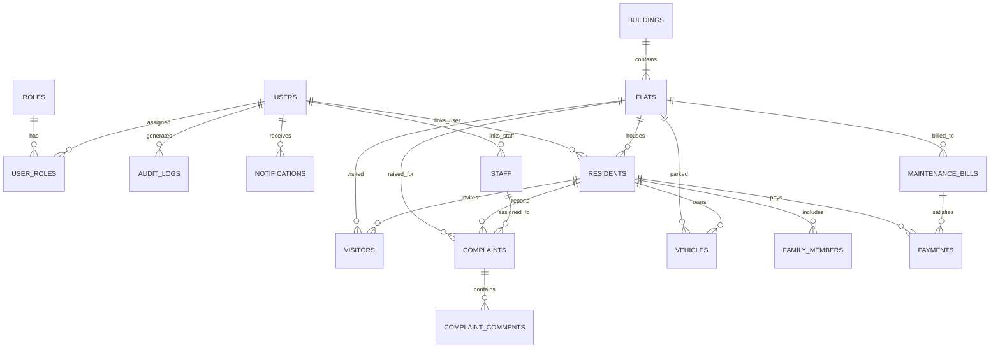

# Database Design & Migration Guide

This document details the database schema, relational model, Flyway migrations, and indexing strategies utilized in **Apartment Society Manager**.

---

## 1. Entity-Relationship Diagram (ERD)



---

## 2. Table Catalog

The schema comprises **18 normalized tables** managed via Flyway versioned migrations:

| # | Table Name | Purpose / Description | Primary Key | Key Foreign Keys |
|---| :--- | :--- | :--- | :--- |
| 1 | `roles` | System authorization roles (`SUPER_ADMIN`, `SOCIETY_ADMIN`, etc.) | `id` (BIGINT) | None |
| 2 | `users` | User credentials, emails, lock status, and profile info | `id` (UUID) | None |
| 3 | `user_roles` | Many-to-many junction between users and roles | Composite | `user_id`, `role_id` |
| 4 | `buildings` | Society residential towers, code, and total flats | `id` (UUID) | None |
| 5 | `flats` | Individual flat units, square footage, occupancy status | `id` (UUID) | `building_id` |
| 6 | `residents` | Owner and tenant resident profiles, lease dates | `id` (UUID) | `user_id`, `flat_id` |
| 7 | `family_members` | Co-occupant family members, relation, and age | `id` (UUID) | `resident_id` |
| 8 | `vehicles` | Two-wheeler and four-wheeler vehicle permits | `id` (UUID) | `resident_id`, `flat_id` |
| 9 | `maintenance_bills` | Monthly dues calculated by flat area + water/parking | `id` (UUID) | `flat_id` |
| 10 | `payments` | Dues payment transactions, receipt numbers, payment methods | `id` (UUID) | `bill_id`, `resident_id`, `created_by_id` |
| 11 | `staff` | Maintenance personnel, electricians, plumbers, security | `id` (UUID) | `user_id` |
| 12 | `complaints` | Resident tickets, categories, priorities, and resolutions | `id` (UUID) | `resident_id`, `flat_id`, `assigned_staff_id` |
| 13 | `complaint_comments`| Internal and resident comment threads on tickets | `id` (UUID) | `complaint_id`, `user_id` |
| 14 | `society_expenses` | Operational expenditures (electricity, security AMC, repairs)| `id` (UUID) | `created_by_id` |
| 15 | `notices` | Society broadcast announcements and circulars | `id` (UUID) | `created_by_id` |
| 16 | `visitors` | Gate entry/exit log, badge numbers, host flat, purpose | `id` (UUID) | `flat_id`, `resident_id`, `checked_in_by_id` |
| 17 | `audit_logs` | Immutable audit trail recording user IP addresses & changes | `id` (UUID) | `user_id` |
| 18 | `notifications` | In-app alerts for bills, tickets, and notices | `id` (UUID) | `user_id` |

---

## 3. Flyway Database Migrations

Database schema versioning is managed by **Flyway**:

* **Location**: `backend/src/main/resources/db/migration/`
* **Migrations**:
  1. `V1__initial_schema.sql`: Full DDL schema creation with constraints, foreign keys, and indexes.
  2. `V2__seed_data.sql`: Fictional demonstration data (roles, towers, sample flats, demo users with BCrypt hashes, sample bills, expenses, and notices).

### Running Migrations

When running against PostgreSQL or H2, Spring Boot automatically detects Flyway on startup and runs pending migrations:

```bash
# Flyway executes automatically on application launch
./mvnw spring-boot:run
```

To run manually via Maven:
```bash
./mvnw flyway:migrate
```

---

## 4. Performance Indexes

The schema includes targeted indexes for high-frequency queries:

* `idx_users_username` & `idx_users_email`: O(1) user lookups during authentication.
* `idx_flats_building`: Filter flats by residential block.
* `idx_residents_flat` & `idx_residents_user`: Fast lookups for resident portal views.
* `idx_bills_flat`, `idx_bills_status`, `idx_bills_period`: Accelerates batch billing calculations and overdue queries.
* `idx_complaints_resident` & `idx_complaints_status`: Quick ticket SLA monitoring.
* `idx_visitors_flat` & `idx_visitors_status`: Fast gate lookups for active checked-in visitors.
* `idx_audit_logs_user` & `idx_audit_logs_created`: High-speed audit log compliance queries.
